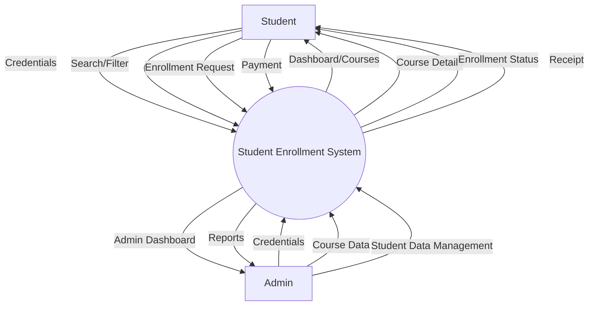
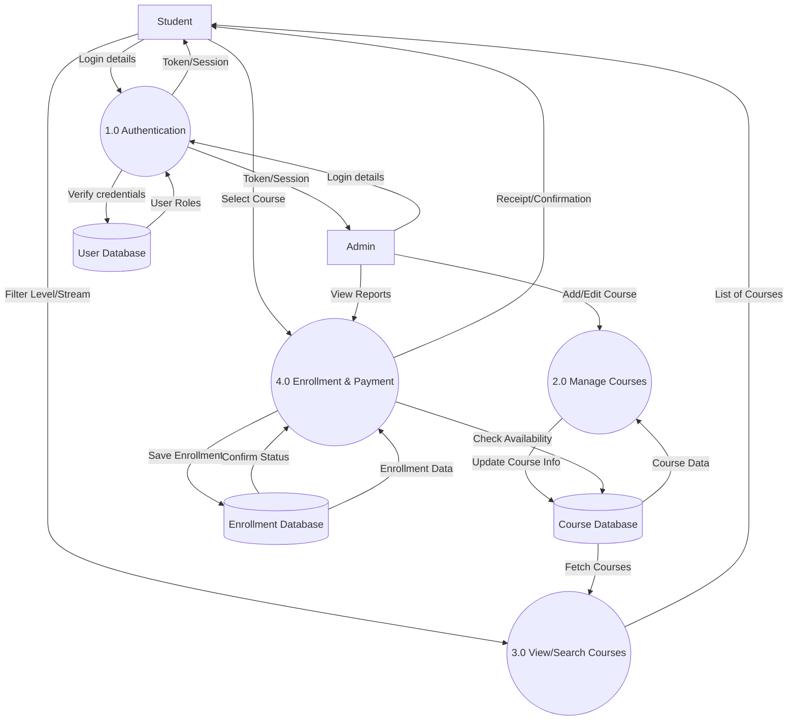
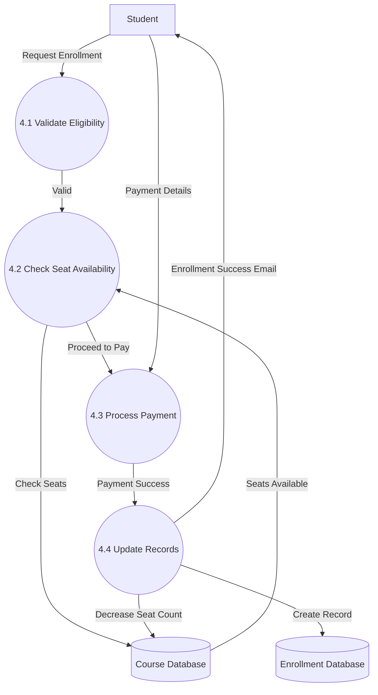

# Data Flow Diagrams (DFD) - Mermaid.js Syntax

You can copy and paste the code blocks below into the [Mermaid Live Editor](https://mermaid.live/) to view the diagrams.

## DFD Level 0 (Context Diagram)
Overview of the system and external entities.

## DFD Level 1 (System Overview)
Breakdown of main system processes.

## DFD Level 2 (Detailed Enrollment Process)
Detailed flow for the Enrollment process (Process 4.0).

